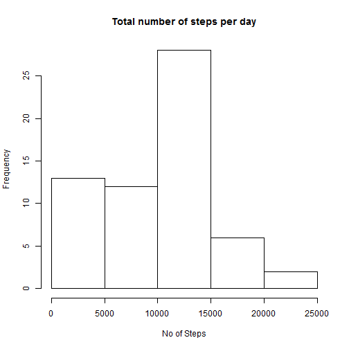
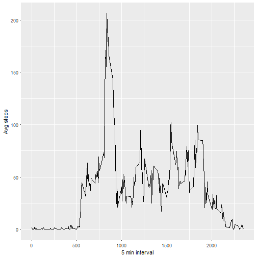
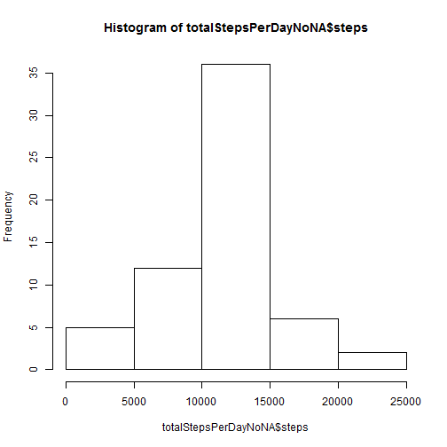

# Reproducible Research Project 1

## Read the file and load into a dataset


```r
library(plyr)
library(ggplot2)
library(knitr)


filename <- "activity.zip"

if (!file.exists("activity.csv")) { 
        unzip(filename)
}

activity <- read.csv("activity.csv", header=TRUE, sep=",")
```
## Histogram of the total number of steps taken each day

```r
StepsPerDay <- tapply(activity$steps, activity$date, sum,na.rm=TRUE)
hist(StepsPerDay,xlab="No of Steps",main="Total number of steps per day")
```



## Mean and median number of steps taken each day

```r
meansteps <- mean(StepsPerDay)
mediansteps <- median(StepsPerDay)
```
Mean steps is 9354.2295082 and median is 10395

## Time series plot of the average number of steps taken

```r
avg <- aggregate(x=list(steps=activity$steps), by=list(interval=activity$interval),
                      FUN=mean, na.rm=TRUE)
ggplot(data=avg, aes(x=interval, y=steps)) +
        geom_line() +
        xlab("5 min interval") +
        ylab("Avg steps")
```



## The 5-minute interval that, on average, contains the maximum number of steps

```r
avg[which.max(avg$steps),]
```

```
##     interval    steps
## 104      835 206.1698
```

## Code to describe and show a strategy for imputing missing data

### how many missing

```r
nrow(activity[is.na(activity$steps),])
```

```
## [1] 2304
```

```r
getMeanStepsPerDay<-function(interval){
        avg[avg$interval==interval,]$steps
}

activityNoNA<-activity
for(i in 1:nrow(activityNoNA)){
        if(is.na(activityNoNA[i,]$steps)){
                activityNoNA[i,]$steps <-getMeanStepsPerDay(activityNoNA[i,]$interval)
        }
}

totalStepsPerDayNoNA <- aggregate(steps ~ date, data=activityNoNA, sum)
```
## Histogram of the total number of steps taken each day after missing values are imputed

```r
hist(totalStepsPerDayNoNA$steps)
```



## Mean and Median after taking care of missing values

```r
meanStepsPerDayNoNA <- mean(totalStepsPerDayNoNA$steps)
medianStepsPerDayNoNA <- median(totalStepsPerDayNoNA$steps)

activityNoNA$date <- as.Date(strptime(activityNoNA$date, format="%Y-%m-%d"))
activityNoNA$day <- weekdays(activityNoNA$date)
for (i in 1:nrow(activityNoNA)) {
        if (activityNoNA[i,]$day %in% c("Saturday","Sunday")) {
                activityNoNA[i,]$day<-"weekend"
        }
        else{
                activityNoNA[i,]$day<-"weekday"
        }
}
stepsByDay <- aggregate(activityNoNA$steps ~ activityNoNA$interval + activityNoNA$day, activityNoNA, mean)
```
## Panel plot comparing the average number of steps taken per 5-minute interval across weekdays and weekends


```r
names(stepsByDay) <- c("interval", "day", "steps")
library(lattice)
xyplot(steps ~ interval | day, stepsByDay, type = "l", layout = c(1, 2), 
       xlab = "Interval", ylab = "Number of steps")
```


